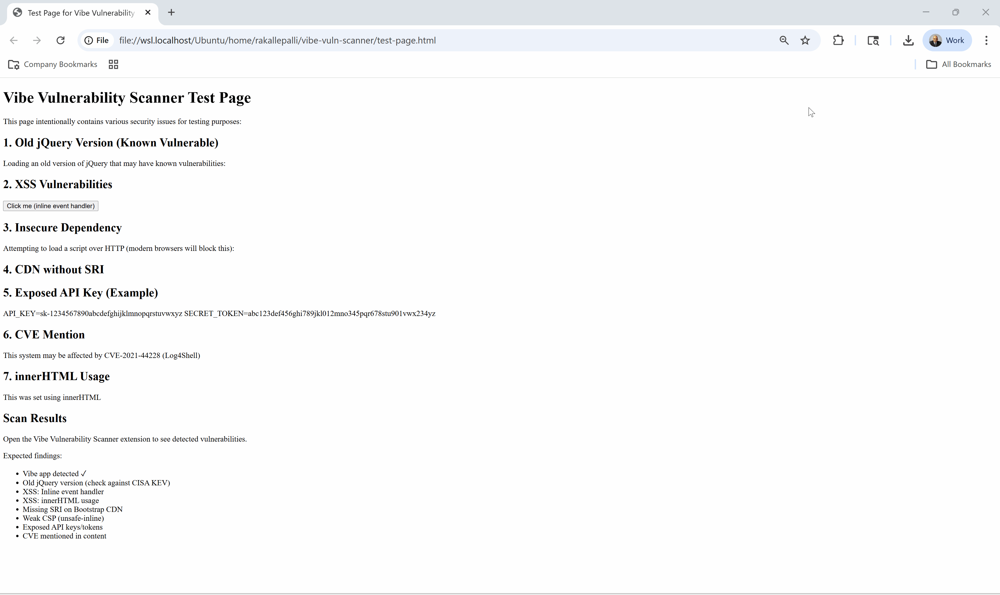
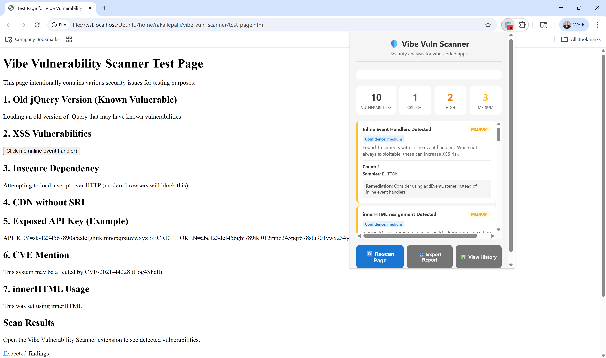
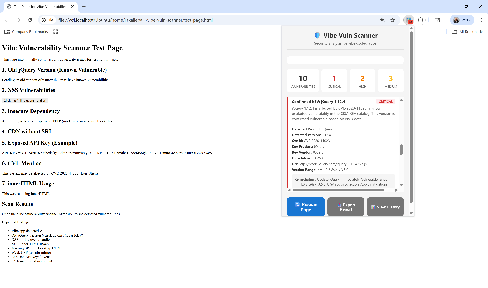
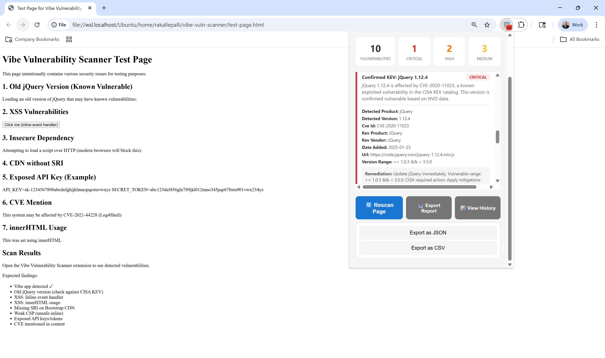
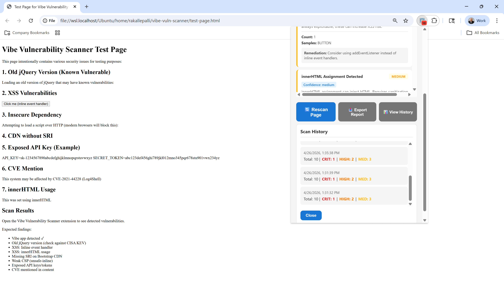

# Vibe Vulnerability Scanner

[](LICENSE)
[](CHANGELOG.md)
[](CONTRIBUTING.md)
[](CODE_OF_CONDUCT.md)

**Catch exploitable vulnerabilities before attackers do.** Real-time security scanning powered by CISA's Known Exploited Vulnerabilities catalog with automatic NVD verification.

<!--  -->

## ✨ Key Features

- 🔍 **Real-time Scanning** - Automatic vulnerability detection on page load
- 🛡️ **CISA KEV Integration** - Checks against official Known Exploited Vulnerabilities catalog
- ✅ **NVD Verification** - Confirms vulnerable versions using NIST CVE data
- 📊 **Persistent History** - Stores last 50 scans per domain (v1.2.0)
- 📤 **Export Results** - Download findings as JSON or CSV (v1.2.0)
- 🔐 **HTTP Header Analysis** - Inspects security headers (v1.2.0)
- 🎯 **Confidence Scoring** - Distinguishes confirmed findings from heuristics
- 🔒 **Privacy First** - All scanning happens locally, no data collection
- ⚡ **Manifest V3** - Modern Chrome extension architecture

## Quick Start

1. Clone this repository
2. Open `chrome://extensions/` in Chrome
3. Enable "Developer mode" (top right)
4. Click "Load unpacked" and select the project directory
5. Navigate to any website and click the extension icon!

Try it on the included `test-page.html` to see detection in action.

## Installation

### For Users

**Chrome Web Store** (Coming Soon)

### For Developers

```bash
# Clone the repository
git clone https://github.com/ramukallepalli/vibe-vuln-scanner.git
cd vibe-vuln-scanner

# Install dependencies
npm install

# Load extension in Chrome
# 1. Navigate to chrome://extensions/
# 2. Enable "Developer mode"
# 3. Click "Load unpacked"
# 4. Select the vibe-vuln-scanner directory

# Run in development mode with auto-reload
npm run dev
```

### Build for Production

```bash
npm run package
```

Creates a `.zip` file in `web-ext-artifacts/` ready for Chrome Web Store submission.

## How It Works

### Understanding the Scanning Model

This extension provides **heuristic security analysis**, not definitive vulnerability confirmation. Results are categorized by:

#### Confidence Levels
- **High**: Strong evidence of the issue (e.g., confirmed HTTP script loading)
- **Medium**: Likely issue but requires verification (e.g., potential secret patterns)
- **Low**: Weak signal requiring manual investigation (e.g., product name matches KEV database)

#### Finding Categories
- **Confirmed**: Objective fact (e.g., missing HTTPS)
- **Probable**: Likely issue based on strong evidence
- **Heuristic**: Pattern-based detection requiring context
- **Informational**: Advisory or suggestion, not a vulnerability

### CISA KEV Correlation with Automatic Version Verification

The extension automatically verifies if detected library versions are vulnerable:

1. **Detects libraries** from script URLs and meta tags (jQuery, React, Vue, Angular, etc.)
2. **Matches products** against CISA KEV catalog
3. **Fetches CVE details** from NVD API to get vulnerable version ranges
4. **Compares versions** to determine if detected version falls in vulnerable range

**Result Classification:**
- **CRITICAL (confirmed)**: Version is confirmed vulnerable based on NVD data → Immediate action required
- **LOW (informational)**: Product matches KEV but version appears safe → Automatically checks if you're on latest stable release
- **MEDIUM (informational)**: Product matches KEV but NVD data unavailable → Manual verification recommended

## What Gets Scanned

### Confirmed Issues
- ✅ **HTTP Scripts**: Loading scripts over insecure HTTP → `HIGH` severity
- ✅ **Weak CSP**: `unsafe-inline` or `unsafe-eval` in CSP → `MEDIUM` severity
- ✅ **Vulnerable Libraries**: Confirmed KEV match with NVD verification → `CRITICAL` severity

### Heuristic Patterns (Require Verification)
- 🔍 **Inline Event Handlers**: `onclick`, `onerror`, etc. → `MEDIUM` severity
- 🔍 **Secret Exposure**: Pattern matching for API keys → `HIGH` severity
- 🔍 **innerHTML Usage**: Potential XSS risk → `LOW` severity, informational
- 🔍 **Missing SRI**: CDN scripts without integrity → `LOW` severity, informational

### Finding Structure

Each finding includes:

```javascript
{
  id: "finding-12345",              // Fingerprint for deduplication
  type: "INLINE_EVENT_HANDLER",
  severity: "MEDIUM",                // CRITICAL, HIGH, MEDIUM, LOW
  confidence: "medium",              // high, medium, low
  category: "heuristic",             // confirmed, probable, heuristic, informational
  title: "Inline Event Handlers Detected",
  description: "Found 3 elements with inline event handlers...",
  evidence: { count: 3, samples: [...] },
  remediation: "Consider using addEventListener...",
  metadata: {},
  timestamp: 1234567890
}
```

<!-- ## Screenshots


*Main scan results interface showing severity breakdown*


*Detailed finding with remediation guidance*


*Export scan results as JSON or CSV (v1.2.0)*


*View historical scans for each domain (v1.2.0)* -->

## Architecture

```
vibe-vuln-scanner/
├── manifest.json              # Extension manifest (MV3)
├── src/
│   ├── content/
│   │   └── scanner.js        # Vulnerability scanner logic (1,150 lines)
│   ├── background/
│   │   └── service-worker.js # KEV management, NVD integration (644 lines)
│   └── popup/
│       ├── popup.html        # Popup UI
│       ├── popup.css         # Styles
│       └── popup.js          # Safe DOM rendering, export, history (481 lines)
├── __tests__/                 # Jest test suite
├── CHANGELOG.md              # Version history
└── package.json              # NPM configuration
```

### Message Flow

1. **Auto-scan**: Content script runs on page load → sends results to background → background stores and updates badge
2. **Manual scan**: Popup requests scan → content script scans → background stores → popup displays results

## Available Scripts

```bash
npm run lint            # Run ESLint
npm run lint:fix        # Auto-fix linting issues
npm test                # Run Jest test suite
npm run test:watch      # Run tests in watch mode
npm run test:coverage   # Generate coverage report
npm run dev             # Run extension with auto-reload
npm run package         # Build production .zip
```

## Security & Privacy

- ✅ **No External Data Transmission**: All scanning is client-side (except public CISA KEV catalog fetch)
- ✅ **No User Tracking**: No analytics, no telemetry
- ✅ **Minimal Permissions**: Only activeTab, storage, alarms, tabs
- ✅ **Safe Rendering**: All popup content rendered via DOM APIs, not innerHTML
- ✅ **HTTPS Only**: KEV catalog and NVD API calls use HTTPS

### Permissions Explained

- `activeTab`: Access current tab's DOM for scanning
- `storage`: Cache CISA KEV catalog and scan history locally
- `alarms`: Schedule periodic KEV refresh (MV3 requirement)
- `tabs`: Detect tab close/navigation for result cleanup

## Limitations

1. **Heuristic XSS Detection**: Presence of `onclick` doesn't prove XSS exploitability
2. **Secret Pattern Matching**: Regex-based, prone to false positives
3. **Client-Side Only**: Cannot inspect server-side code or HTTP response headers
4. **No DOM XSS Analysis**: Does not trace data flow to detect DOM-based XSS
5. **Version Detection**: Relies on version numbers in script URLs/meta tags

## Contributing

We welcome contributions! See [CONTRIBUTING.md](CONTRIBUTING.md) for guidelines.

**Good first issues**: [View beginner-friendly tasks](https://github.com/ramukallepalli/vibe-vuln-scanner/issues?q=is%3Aissue+is%3Aopen+label%3A%22good+first+issue%22)

### Adding New Vulnerability Checks

```javascript
scanNewPattern() {
  const findings = [];

  findings.push(this.createFinding({
    type: 'NEW_PATTERN',
    severity: 'MEDIUM',
    confidence: 'low',
    category: 'heuristic',
    title: 'Pattern Detected',
    description: 'Explanation of what was found',
    evidence: { key: 'value' },
    remediation: 'How to fix'
  }));

  return findings;
}
```

Call from `runScans()` and findings will be auto-deduplicated.

## Testing

### Automated Tests

```bash
npm test
```

Test suite includes:
- Version parsing and comparison logic
- Finding deduplication
- Secret pattern detection
- Chrome API mocking

### Manual Testing

The included `test-page.html` contains intentional issues:
- Inline event handlers
- innerHTML usage
- Missing SRI
- Weak CSP
- Potential secret exposure patterns

## CISA KEV Integration

- **Source**: https://www.cisa.gov/known-exploited-vulnerabilities-catalog
- **Update Frequency**: Every 6 hours via chrome.alarms
- **Storage**: chrome.storage.local (survives extension restarts)
- **NVD Integration**: Fetches CVE details from https://services.nvd.nist.gov/rest/json/cves/2.0
- **Caching**: KEV (24h), CVE details (permanent), npm version info (1h)

## Changelog

See [CHANGELOG.md](CHANGELOG.md) for detailed version history.

## License

Apache License 2.0 - see [LICENSE](LICENSE) file for details.

Copyright 2024 eBay Inc.

## Acknowledgments

- Contributors: See [AUTHORS.md](AUTHORS.md)
- Built at eBay and open-sourced for the community
- Powered by [CISA KEV](https://www.cisa.gov/known-exploited-vulnerabilities-catalog) and [NIST NVD](https://nvd.nist.gov/)

## Support

- **Issues**: [GitHub Issues](https://github.com/ramukallepalli/vibe-vuln-scanner/issues)
- **Discussions**: [GitHub Discussions](https://github.com/ramukallepalli/vibe-vuln-scanner/discussions)
- **Security**: See [SECURITY.md](SECURITY.md) for vulnerability reporting

---

**Made with ❤️ by the security community**
